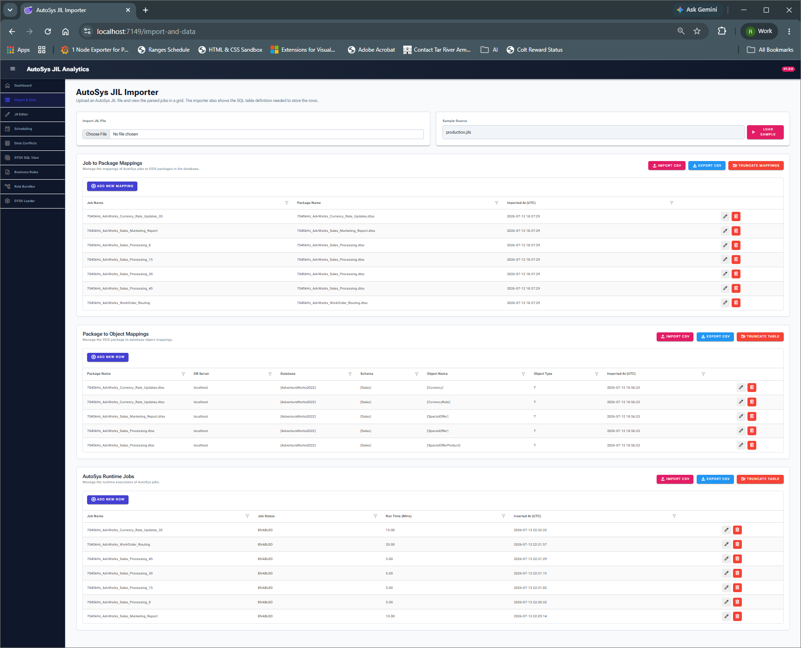
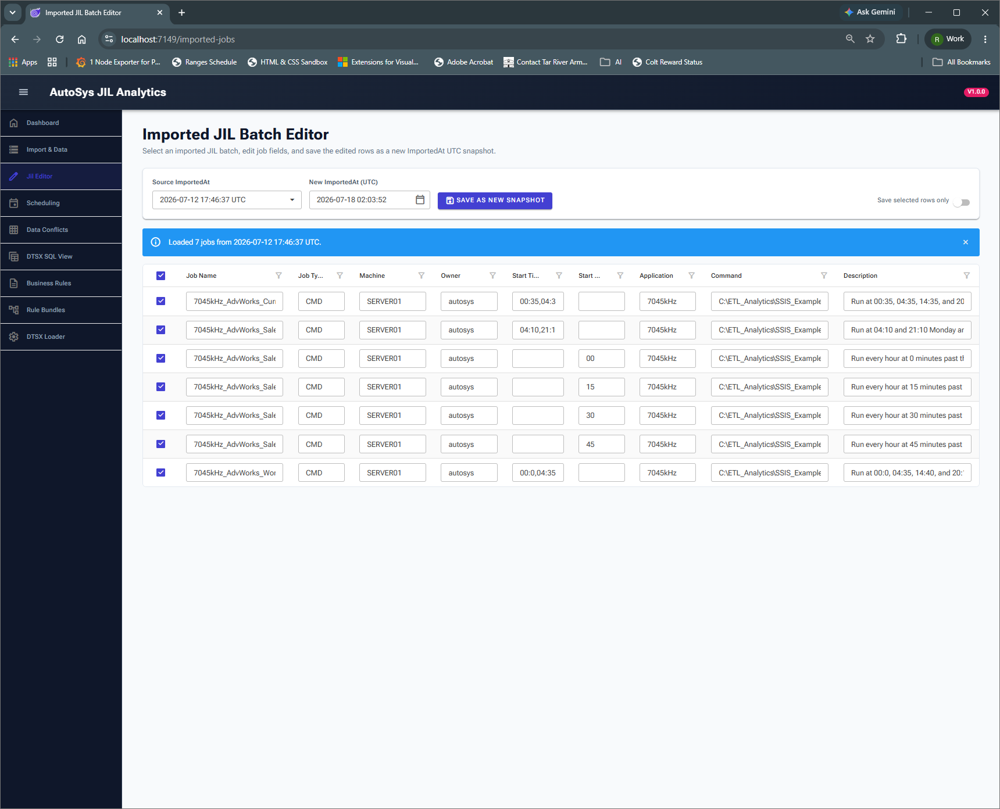
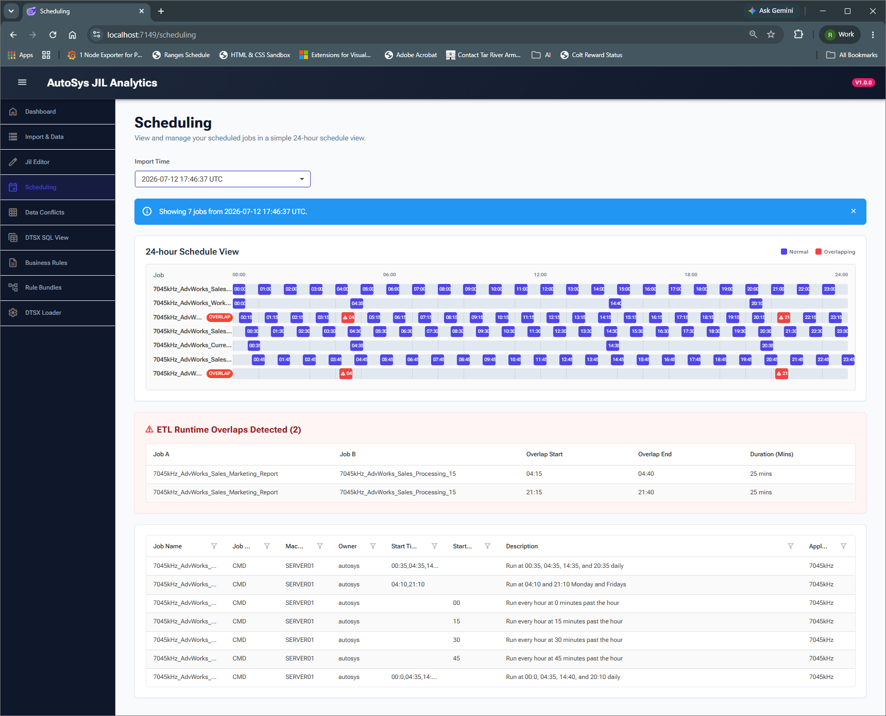
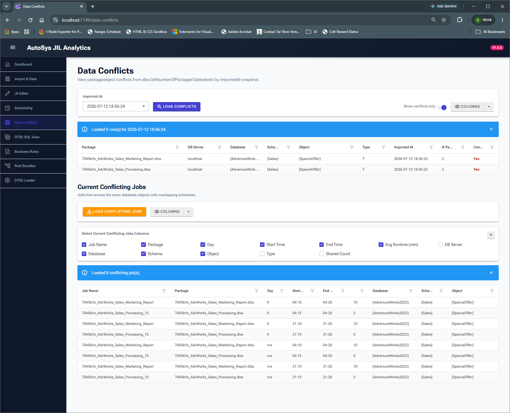
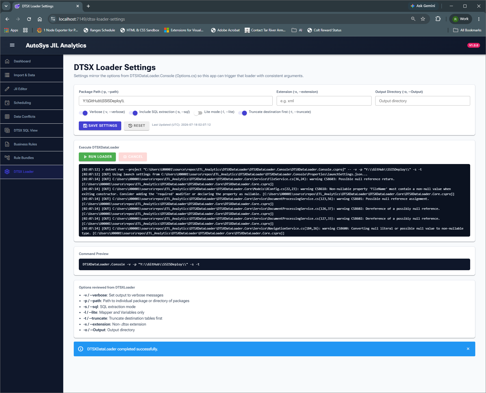
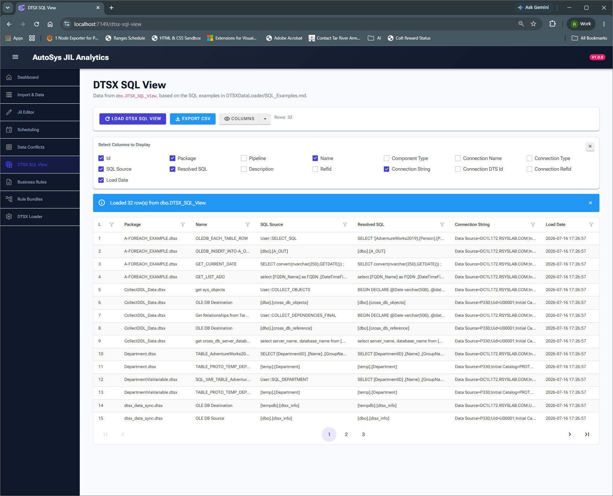
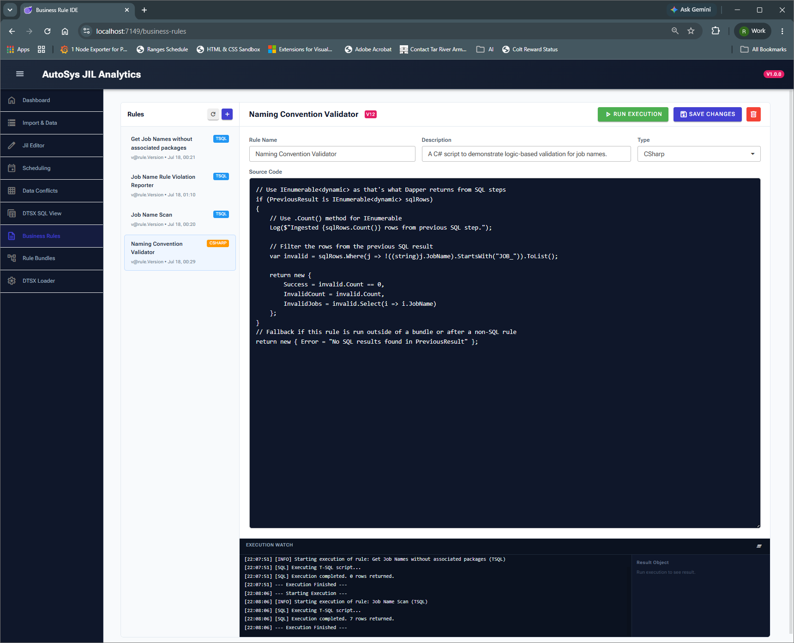
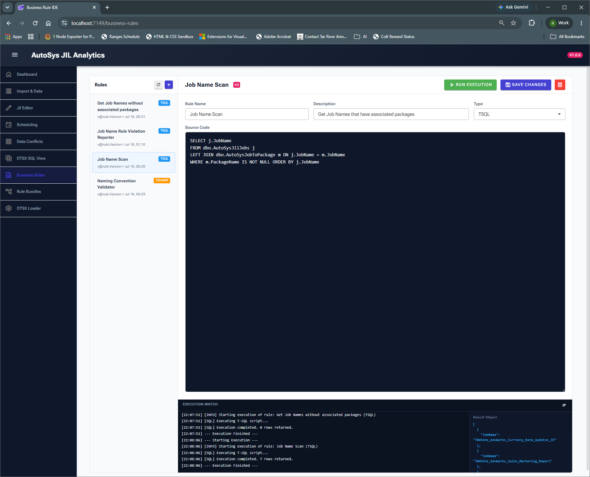
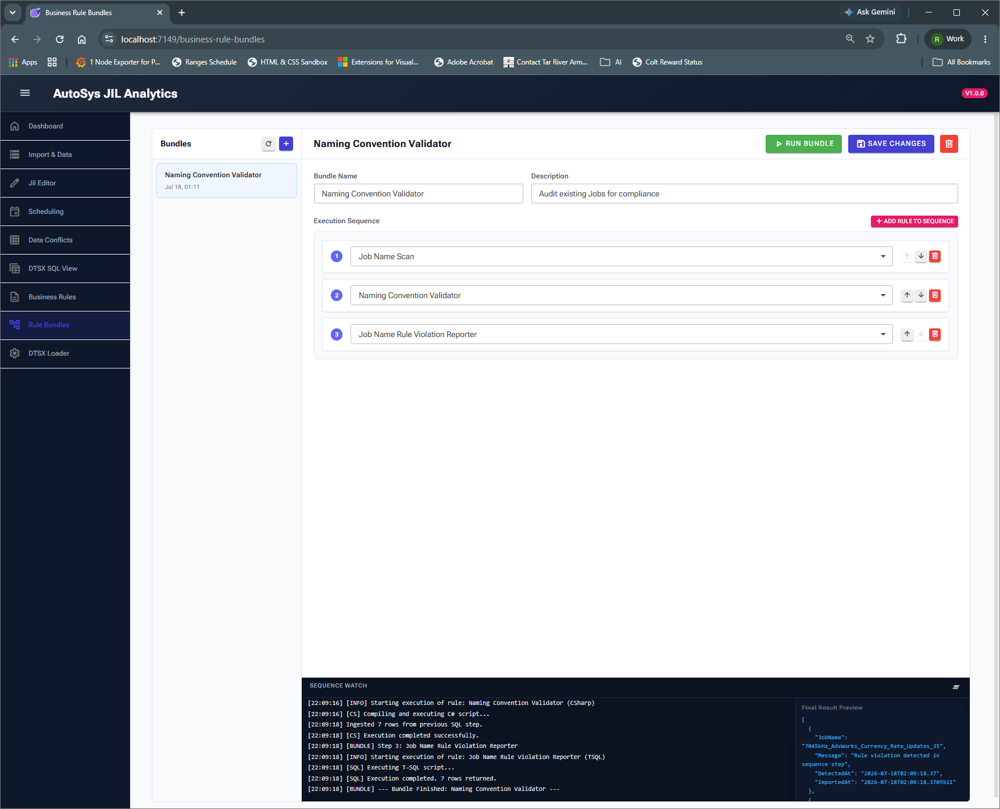

# ETL Analytics

ETL Analytics is a **.NET 10 Blazor Server** application for ingesting AutoSys and DTSX metadata, mapping ETL dependencies, and surfacing runtime/scheduling conflicts.

## Status
Active development.

## Business Summary

ETL Analytics gives operations, ETL engineering, and data governance teams a single operational view of batch workloads and data movement dependencies. It reduces manual investigation by connecting AutoSys schedules, SSIS package metadata, and database object usage into one application.

From a business perspective, the platform helps teams:
- Lower incident risk by identifying scheduling and data-access conflicts earlier
- Improve change planning by showing job-to-package-to-object lineage
- Accelerate root-cause analysis with searchable runtime and SQL mapping views
- Standardize ETL metadata management through repeatable import, editing, and snapshot workflows

Key delivered capabilities include JIL snapshot management, schedule conflict visualization, data conflict analysis, in-app DTSX loader execution, and SQL lineage inspection through `dbo.DTSX_SQL_View`.

The application also includes a Business Rules subsystem with rule authoring, versioning, and bundle-based execution for operational validations and ETL governance workflows.

## What this solution provides

- AutoSys JIL import and persistence by `ImportedAt` snapshot
- JIL batch editor (clone/edit existing import and save as a new UTC snapshot)
- 24-hour scheduling view with conflict highlighting aligned to `dbo.GetCurrentConflictingJobs`
- Data conflicts dashboard for package/object overlap analysis
- In-app `DTSXDataLoader` settings + execution with live log output
- DTSX SQL inspection grid over `dbo.DTSX_SQL_View` with filtering, column selection, and CSV export
- Business Rules IDE for authoring and running T-SQL/C# rules
- Business Rule Bundles for ordered multi-step execution with result piping

## Main pages

| Page | Route | Purpose |
|---|---|---|
| Dashboard | `/` | High-level KPIs and navigation |
| Import & Data | `/import-and-data` | Import JIL and manage mappings |
| JIL Editor | `/imported-jobs` | Edit imported jobs and save a new snapshot |
| Scheduling | `/scheduling` | 24-hour schedule view and overlap analysis |
| Data Conflicts | `/data-conflicts` | Conflict and conflicting-job analysis |
| DTSX Loader Settings | `/dtsx-loader-settings` | Configure and execute `DTSXDataLoader` |
| DTSX SQL View | `/dtsx-sql-view` | Query results from `dbo.DTSX_SQL_View` |
| Business Rules | `/business-rules` | Create, version, and execute T-SQL/C# rules |
| Rule Bundles | `/business-rule-bundles` | Build and run ordered rule sequences |

## Screenshots

### Dashboard


### Import & Data


### JIL Editor


### Scheduling


### Data Conflicts


### DTSX Loader Settings


### DTSX SQL View


### Business Rules - C# Script


### Business Rules - SQL Script


### Business Rules Bundle - Combined Execution


## Prerequisites

- .NET SDK 10.x
- SQL Server access for the target database
- `DB_CONNECTION_STRING` environment variable

## Run locally

1. Set connection string (PowerShell):

```powershell
$env:DB_CONNECTION_STRING = "Data Source=SERVER;Initial Catalog=DB;Trusted_Connection=True;Encrypt=False"
```

2. Build and run:

```bash
dotnet build AutoSysJilBlazor/AutoSysJilBlazor.csproj
dotnet run --project AutoSysJilBlazor/AutoSysJilBlazor.csproj
```

## Publish

```bash
dotnet publish AutoSysJilBlazor/AutoSysJilBlazor.csproj -c Release -r win-x64 --self-contained true
```

Copy the publish output to the target machine and run the generated executable.

## Related docs

- SQL Preparation : [`SQL/Prep_Tables.sql`](./SQL/Prep_Tables.sql)
- DTSX loader details: [`DTSXDataLoader/README.md`](./DTSXDataLoader/README.md)
- DTSX SQL examples: [`DTSXDataLoader/SQL_Examples.md`](./DTSXDataLoader/SQL_Examples.md)
- Business rules reference: [`BUSINESS_RULES.md`](./BUSINESS_RULES.md)
- Architecture overview: [`ArchitectureOverview.md`](./ArchitectureOverview.md)
